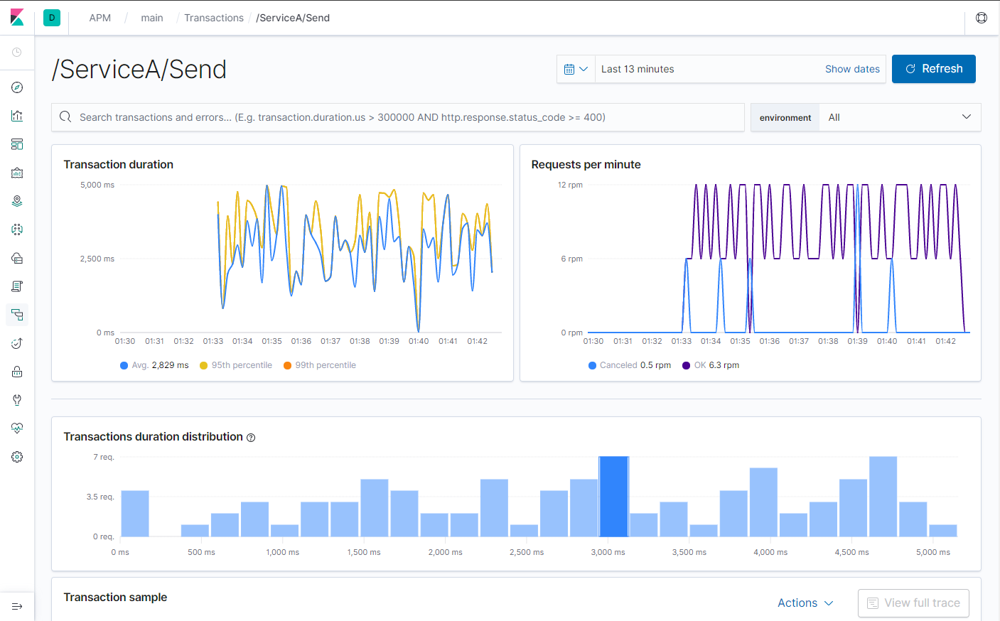

## Example of integrating apm monitoring with gRPC
To track all gRPC calls the special APM Interceptor should be added to the options.

For example for Unary calls 
#### Server
```golang
var opts []grpc.ServerOption{}
opts = append(opts, grpc.UnaryInterceptor(apmgrpc.NewUnaryServerInterceptor()))
```
#### Client 
```golang
var opts []grpc.DialOption
opts = append(opts, grpc.WithUnaryInterceptor(apmgrpc.NewUnaryClientInterceptor()))
```

Calls can be viewed in Kibana UI
