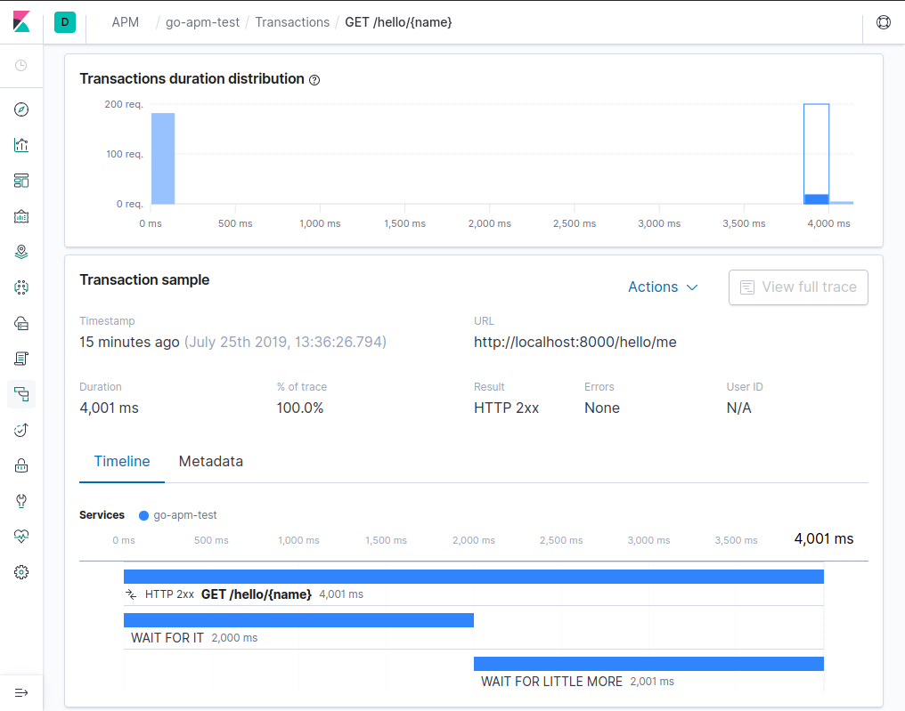

## Simplest example of working Elastic APM Go agent with integration in Kubernetes 
It traces gorilla/mux calls and custom wait spans.
You can test it using some simple request libarary like https://github.com/rakyll/hey

Result of sending 200 requests can be inspected using kibana
